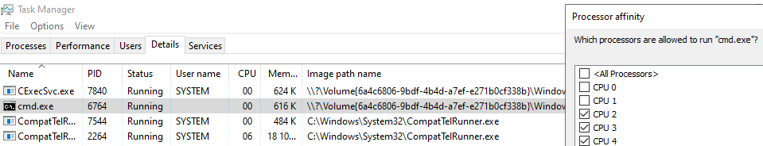

# Container Cpu Affinity
Minimal [Windows certified](https://partner.microsoft.com/en-us/dashboard/hardware/Driver/DownloadCertificationReport/0/14283472432912879/1152921505700495262) kernel mode driver which ensure that first two CPU cores are reserved for system processes. Driver is digitally signed by Microsoft and can be used in systems where [Secure Boot](https://support.microsoft.com/en-us/windows/windows-11-and-secure-boot-a8ff1202-c0d9-42f5-940f-843abef64fad) is enabled.

## Which problem it solves?
In shared platform, every node can run hundreds of containers and it is very easy to break system by overloading CPU in way that system processes starts generating errors.

In Linux that can be solved by providing `--cpuset-cpus` parameter for docker run command but unfortunately that feature [is not supported in Windows](https://github.com/moby/moby/issues/51995).

## How it works?
Windows will start new `CExecSvc.exe` (Container Execution Agent) process for every container and all processes starting inside of container will be child of that.

`ContainerCpuAffinity` driver will detect `CExecSvc.exe` when starts and set CPU affinity for it in way that it can use all other CPU cores expect two first ones.

## Usage
* Download driver from releases.
* Unzip and run `install.cmd`
* Start new container (e.g. `docker run -it --rm mcr.microsoft.com/windows/nanoserver:ltsc2025`)
* Check from task manager that CPU affinity was configured correctly for cmd.exe process:

